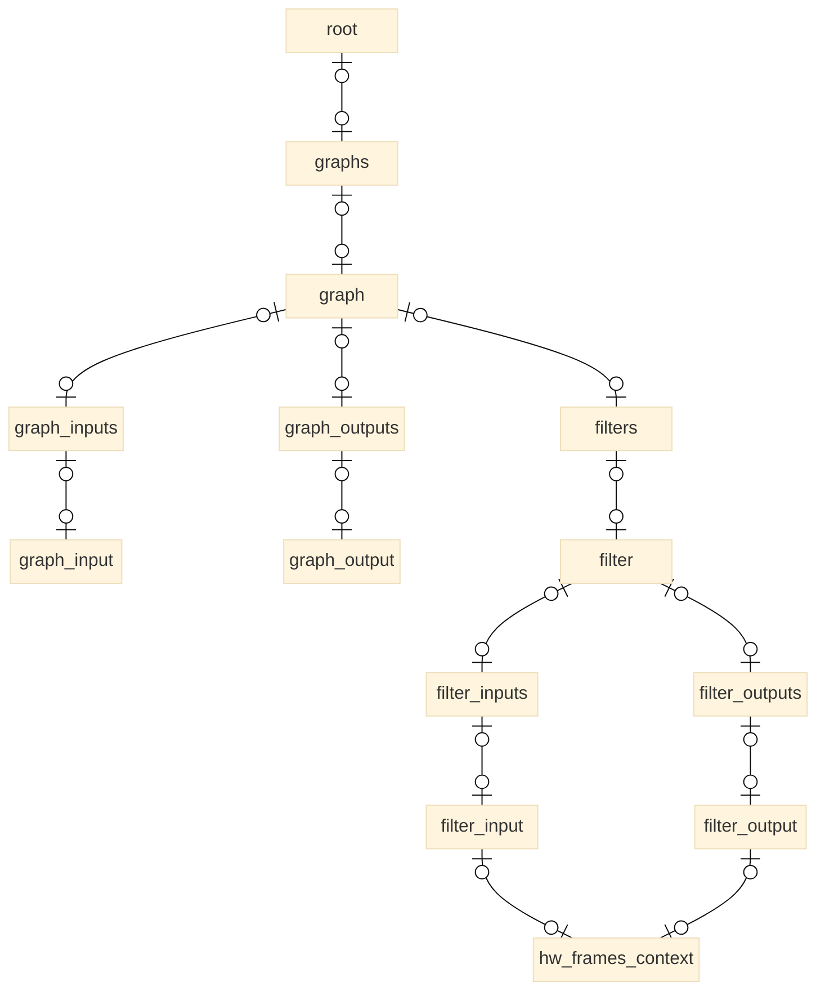
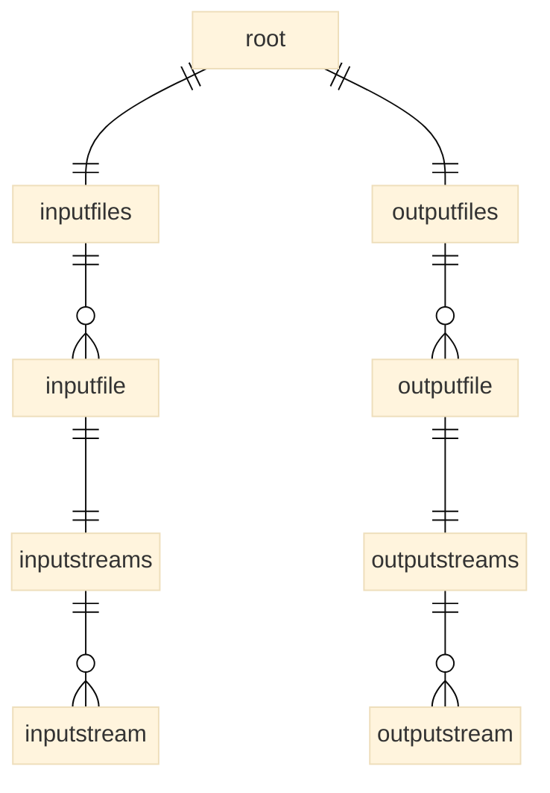
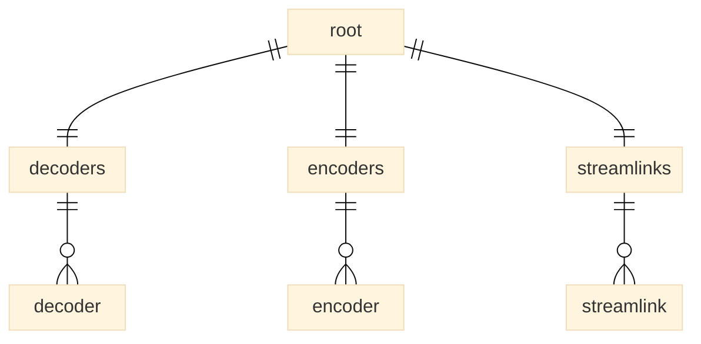

# Execution Graph Entities

## Execution Graph Entities

### Introduction

The buildings blocks which are relevant for outputting filtergraph are  already structured very well in FFmpeg. This allows for the data model to stay vey close to the internal architecture.    
Some of the text formatters though, cannot arbitrarily mix child elements of different type or cardinality, which means that we need additional intermediate elements in cases of one-to-many relationships or in terms of the existing implementation: when an entity holds an "array" of child elements. This "verbose" kind of modeling has also shown to be quite helpful for the visulization part. 
For a (previously) mono-purposed API like that, it is typical that it may need to be extended in certain ways to accommodate for other use cases, but it turned out this wasn't even needed for the sole part of data export - but for the visualization it was crucial to extend it some minor ways.

### About Symmetry - or the Lack Thereof

A notable topic - clearly visible all throughoutt the model: one can easily gein the impression that there might be a lot of unnecessary duplication of entity types due to symmetry. When looking deeper this isn't true, though.
For example, a filter has InputLinks and OutputLinks and both have an identical set of properties/fields - except one difference: An InputLink has a source-id field which indicates the filter (or other entity) from where the link is comning from, while the destination id is their own (the owning filter's) id. An output link on the other hand has it's own id being the source id and the dest-id is pointing to another filter. This is an important difference in semantics and therefore it cannot be the same type of entity. Of course in a code model, one would usually want a common implementation - but this is a data model and an entity type cannot (or should not) vary in its relational constraints.

## Data Sections

### The Core: Graphs and Filters

Let's start with innermost elements: Graphs, filters and related types, as shown in the diagram below:

Let's go through the elements briefly:

- **root**  
  just the main container of everything
- **graphs**    
  contains all filter graphs - complex and simple  
  this extra container is needed because there are other top-level containers and mixed elements are not allowed by all text formats
- **graph**  
  the top container for everything in a filter graph
- **graph_inputs**, **graph_outputs**  
  container for inputs and outputs
- **graph_input**, **graph_output**  
  these elements are markers to the actual filters that are at the entry or exit side of a fileraph.
  In a strict sense, these are redundant. It would also be possible to determine the entry and exit filters of a graph by following the paths of all links. For an interactive user looking that the data, this is a very tedious task and hence there's still  value in having that information included, allowing you to easily and quickly determine the edge filters.
- **filters**  
  container for filters in a graph
- **filter**  
  probably the most important element. Unfortunately, available data is limited at the moment because a lot has been made private for reasons unknown to me, so for whatever more we want to incliude will require to drll some hole into that isolation.
- **filter_inputs**, **filter_outputs**  
  containers for input and output links of a filter
- **filter_input**, **filter_output**  
  these are the links between filters on the input and output side

  ## InputFiles and OutputFiles

- **inputfiles**, **outputfiles**  
  containers for inputs and outputs of the FFmpeg session
- **inputfile**, **outputfile**
  represents a single input or output file, doesn't actually need to be a file
- **inputstreamss**, **outputstreamss**  
  containers for streams
- **inputstreams**, **outputstreams**
  only minimal information is included for streams like media_type and codec
  by combining the `index` values from in/outputfile and in/outputstream you get a stream identifier like used in FFmpeg command lines, like: `#1.2`

  ## Decoders, Encoders and StreamLinks

(tbc)

## Extended Information

The original intent was to output filtergraphs, filters, both of their inputs and outputs but no more. The author had a solution for a decade which was gathering additional information from FFmpeg's log outputs in order to complement the filtergraph data with additional information and visualize a larger context. Obviously that's a tough path for the majority of users and not suitable for occasional users, so eventually the scope was extended for providing the full picture in the output for everyone and easily.

(to be continued...)