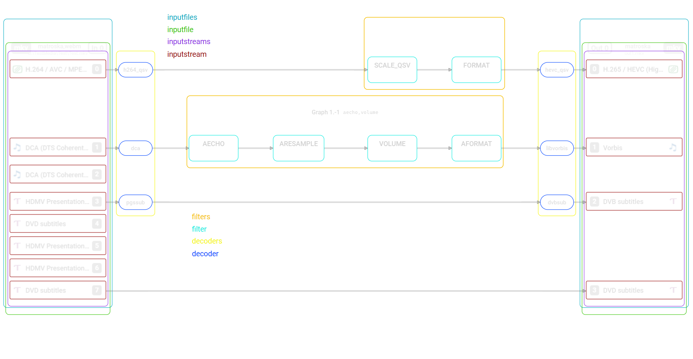

# Translating the Data for Visualization

## Translating the Data for Visualization


### Extending the AVTextFormat API


The graph visualization could have been implemented locally to graphprint.c, but should there be another case in the future where data/diagram output is desired, this would have created once another copy-paste situation, so the printing was done as just as another textformatter.

To enable this for universal use, a number of extensions to the API are introduced.

#### Section Flags

The following new section flags are added:

- AV_TEXTFORMAT_SECTION_FLAG_IS_SUBGRAPH  
  Each section of this tzpe should be rendered as a subgraph enclosing all contained elements
- AV_TEXTFORMAT_SECTION_FLAG_IS_SHAPE  
  Each section with this flag is rendered as a shape 
  Shapes can have content but cannot contain other shapes nor subgraphs
- AV_TEXTFORMAT_SECTION_PRINT_TAGS  
  This flag indicate that the content in this section should be used and printed in the contex of the current parent element
- AV_TEXTFORMAT_SECTION_FLAG_HAS_LINKS
  This indicates that a section represents a link when it prints the corresponding fiels
  Links are always printed out-of-band, i.e. they are written to a buffer and that buffer is written ro to the actual output only short before the end of printing.


#### New Members to AVTextFormatSection

For graph visualization there are a number of cases where the text/diagram formatter needs additional inforrmation. In most of these cases the information is printed anyway already, the formatter just doesn't know which of the data fields holds which information.

The following members are added to AVTextFormatSection:

```c
    const char *id_key;          ///< name of the key to be used as the id 
    const char *src_id_key;     ///< name of the key to be used as the source id for diagram connections
    const char *dest_id_key;   ///< name of the key to be used as the target id for diagram connections
    const char *linktype_key; ///< name of the key to be used as the link type for diagram connections 
```

This allows the diagram formatter to collect this information while an element in a section is still 
open and print  that (.d)


#### New `AvTextFormatSectionContext` struct

This is an alternative method to the above. A new `AVTextFormatSectionContext` structure is added with members like shown below:                   

```c
typedef struct AVTextFormatSectionContext {
    const char *context_id;
    const char *context_type;
    int context_flags;
} AVTextFormatSectionContext;
```

This leverages the existing way for supplying extra data in the second parameter of the `avtext_print_section_header()` API function.
The current logic for this (opaque) data is that one can set a function `get_type()` in the `AVTextFormatSection` structure and when that is defined, a formatter can call it, supplying the opaque data pointer.
The intended logic for extending would be: 

=> If no `get_type()` function is defined for the section but the the `data` parameter is non-NULL, then it can be assumed that it can be cast to an `AVTextFormatSectionContext` structure.

> [!NOTE]
> There exists a certain overlap between the latter two methods but also differences, so this might need further discussion.


### Using Data Elements for Graph Visualization

With the new section flags from above, the individual sections can be marked appropriately to define the way(s) how they are contributing to the diagram creation. Also notable: All sections having none of those flags are simply ignored.

#### Execution Graph Element Mapping

This table shows the mapping of execution graph sections to diagram content:


<table><colgroup>
<col align="left">
<col align="center">
<col align="center">
<col align="center">
<col align="center">
<col align="left">
</colgroup>
<thead>
  <tr>
    <th class="tg-0pky"></th>
    <th class="tg-c3ow">Subgraph</th>
    <th class="tg-c3ow">Shape</th>
    <th class="tg-c3ow">Link</th>
    <th class="tg-c3ow">PrintTags</th>
    <th class="tg-0pky">Notes</th>
  </tr></thead>
<tbody>
  <tr>
    <td class="tg-0pky">root</td>
    <td class="tg-c3ow"></td>
    <td class="tg-c3ow"></td>
    <td class="tg-c3ow"></td>
    <td class="tg-c3ow"></td>
    <td class="tg-lboi" rowspan="7">All ignored</td>
  </tr>
  <tr>
    <td class="tg-0pky">&nbsp;&nbsp;graphs</td>
    <td class="tg-c3ow"></td>
    <td class="tg-c3ow"></td>
    <td class="tg-c3ow"></td>
    <td class="tg-c3ow"></td>
  </tr>
  <tr>
    <td class="tg-0pky">&nbsp;&nbsp;&nbsp;&nbsp;graph</td>
    <td class="tg-c3ow"></td>
    <td class="tg-c3ow"></td>
    <td class="tg-c3ow"></td>
    <td class="tg-c3ow"></td>
  </tr>
  <tr>
    <td class="tg-0pky">&nbsp;&nbsp;&nbsp;&nbsp;&nbsp;&nbsp;graph_inputs</td>
    <td class="tg-c3ow"></td>
    <td class="tg-c3ow"></td>
    <td class="tg-c3ow"></td>
    <td class="tg-c3ow"></td>
  </tr>
  <tr>
    <td class="tg-0pky">&nbsp;&nbsp;&nbsp;&nbsp;&nbsp;&nbsp;&nbsp;&nbsp;graph_input</td>
    <td class="tg-c3ow"></td>
    <td class="tg-c3ow"></td>
    <td class="tg-c3ow"></td>
    <td class="tg-c3ow"></td>
  </tr>
  <tr>
    <td class="tg-0pky">&nbsp;&nbsp;&nbsp;&nbsp;&nbsp;&nbsp;graph_outputs</td>
    <td class="tg-c3ow"></td>
    <td class="tg-c3ow"></td>
    <td class="tg-c3ow"></td>
    <td class="tg-c3ow"></td>
  </tr>
  <tr>
    <td class="tg-0pky">&nbsp;&nbsp;&nbsp;&nbsp;&nbsp;&nbsp;&nbsp;&nbsp;graph_output</td>
    <td class="tg-c3ow"></td>
    <td class="tg-c3ow"></td>
    <td class="tg-c3ow"></td>
    <td class="tg-c3ow"></td>
  </tr>
  <tr>
    <td class="tg-0pky">&nbsp;&nbsp;filters</td>
    <td class="tg-c3ow">✔</td>
    <td class="tg-c3ow"></td>
    <td class="tg-c3ow"></td>
    <td class="tg-c3ow"></td>
    <td class="tg-0pky"></td>
  </tr>
  <tr>
    <td class="tg-0pky">&nbsp;&nbsp;&nbsp;&nbsp;filter</td>
    <td class="tg-c3ow"></td>
    <td class="tg-c3ow">✔</td>
    <td class="tg-c3ow"></td>
    <td class="tg-c3ow">✔</td>
    <td class="tg-0pky"></td>
  </tr>
  <tr>
    <td class="tg-0pky">&nbsp;&nbsp;&nbsp;&nbsp;&nbsp;&nbsp;filter_inputs</td>
    <td class="tg-c3ow"></td>
    <td class="tg-c3ow"></td>
    <td class="tg-c3ow"></td>
    <td class="tg-c3ow"></td>
    <td class="tg-0pky">(ignored)</td>
  </tr>
  <tr>
    <td class="tg-0pky">&nbsp;&nbsp;&nbsp;&nbsp;&nbsp;&nbsp;&nbsp;&nbsp;filter_input</td>
    <td class="tg-c3ow"></td>
    <td class="tg-c3ow"></td>
    <td class="tg-c3ow">✔</td>
    <td class="tg-c3ow"></td>
    <td class="tg-0pky"></td>
  </tr>
  <tr>
    <td class="tg-0pky">&nbsp;&nbsp;&nbsp;&nbsp;&nbsp;&nbsp;filter_outputs</td>
    <td class="tg-c3ow"></td>
    <td class="tg-c3ow"></td>
    <td class="tg-c3ow"></td>
    <td class="tg-c3ow"></td>
    <td class="tg-0pky">(ignored)</td>
  </tr>
  <tr>
    <td class="tg-0pky">&nbsp;&nbsp;&nbsp;&nbsp;&nbsp;&nbsp;&nbsp;&nbsp;filter_output</td>
    <td class="tg-c3ow"></td>
    <td class="tg-c3ow"></td>
    <td class="tg-c3ow">✔</td>
    <td class="tg-c3ow"></td>
    <td class="tg-0pky"></td>
  </tr>
  <tr>
    <td class="tg-0pky">&nbsp;&nbsp;&nbsp;&nbsp;&nbsp;&nbsp;&nbsp;&nbsp;&nbsp;&nbsp;hw_frames_context</td>
    <td class="tg-c3ow"></td>
    <td class="tg-c3ow"></td>
    <td class="tg-c3ow"></td>
    <td class="tg-c3ow"></td>
    <td class="tg-0pky">for graphs, graphprint.c includes the values in the parent section</td>
  </tr>
  <tr>
    <td class="tg-0pky">&nbsp;&nbsp;inputfiles</td>
    <td class="tg-c3ow">✔</td>
    <td class="tg-c3ow"></td>
    <td class="tg-c3ow"></td>
    <td class="tg-c3ow"></td>
    <td class="tg-0pky">invisible subgraph</td>
  </tr>
  <tr>
    <td class="tg-0pky">&nbsp;&nbsp;&nbsp;&nbsp;inputfile</td>
    <td class="tg-c3ow">✔</td>
    <td class="tg-c3ow"></td>
    <td class="tg-c3ow"></td>
    <td class="tg-c3ow"></td>
    <td class="tg-0pky"></td>
  </tr>
  <tr>
    <td class="tg-0pky">&nbsp;&nbsp;&nbsp;&nbsp;&nbsp;&nbsp;inputstreams</td>
    <td class="tg-c3ow">✔</td>
    <td class="tg-c3ow"></td>
    <td class="tg-c3ow"></td>
    <td class="tg-c3ow"></td>
    <td class="tg-0pky">invisible subgraph</td>
  </tr>
  <tr>
    <td class="tg-0pky">&nbsp;&nbsp;&nbsp;&nbsp;&nbsp;&nbsp;&nbsp;&nbsp;inputstream</td>
    <td class="tg-c3ow"></td>
    <td class="tg-c3ow">✔</td>
    <td class="tg-c3ow"></td>
    <td class="tg-c3ow">✔</td>
    <td class="tg-0pky"></td>
  </tr>
  <tr>
    <td class="tg-0pky">&nbsp;&nbsp;outputfiles</td>
    <td class="tg-c3ow">✔</td>
    <td class="tg-c3ow"></td>
    <td class="tg-c3ow"></td>
    <td class="tg-c3ow"></td>
    <td class="tg-0pky">invisible subgraph</td>
  </tr>
  <tr>
    <td class="tg-0pky">&nbsp;&nbsp;&nbsp;&nbsp;outputfile</td>
    <td class="tg-c3ow">✔</td>
    <td class="tg-c3ow"></td>
    <td class="tg-c3ow"></td>
    <td class="tg-c3ow"></td>
    <td class="tg-0pky"></td>
  </tr>
  <tr>
    <td class="tg-0pky">&nbsp;&nbsp;&nbsp;&nbsp;&nbsp;&nbsp;outputstreams</td>
    <td class="tg-c3ow">✔</td>
    <td class="tg-c3ow"></td>
    <td class="tg-c3ow"></td>
    <td class="tg-c3ow"></td>
    <td class="tg-0pky">invisible subgraph</td>
  </tr>
  <tr>
    <td class="tg-0pky">&nbsp;&nbsp;&nbsp;&nbsp;&nbsp;&nbsp;&nbsp;&nbsp;outputstream</td>
    <td class="tg-c3ow"></td>
    <td class="tg-c3ow">✔</td>
    <td class="tg-c3ow"></td>
    <td class="tg-c3ow">✔</td>
    <td class="tg-0pky"></td>
  </tr>
  <tr>
    <td class="tg-0pky">&nbsp;&nbsp;streamlinks</td>
    <td class="tg-c3ow"></td>
    <td class="tg-c3ow"></td>
    <td class="tg-c3ow"></td>
    <td class="tg-c3ow"></td>
    <td class="tg-0pky">(ignored)</td>
  </tr>
  <tr>
    <td class="tg-0pky">&nbsp;&nbsp;&nbsp;&nbsp;streamlink</td>
    <td class="tg-c3ow"></td>
    <td class="tg-c3ow"></td>
    <td class="tg-c3ow">✔</td>
    <td class="tg-c3ow"></td>
    <td class="tg-0pky"></td>
  </tr>
  <tr>
    <td class="tg-0pky">&nbsp;&nbsp;decoders</td>
    <td class="tg-c3ow">✔</td>
    <td class="tg-c3ow"></td>
    <td class="tg-c3ow"></td>
    <td class="tg-c3ow"></td>
    <td class="tg-0pky">invisible subgraph</td>
  </tr>
  <tr>
    <td class="tg-0pky">&nbsp;&nbsp;&nbsp;&nbsp;decoder</td>
    <td class="tg-c3ow"></td>
    <td class="tg-c3ow">✔</td>
    <td class="tg-c3ow">✔</td>
    <td class="tg-c3ow">✔</td>
    <td class="tg-0pky">used for both, shape rendering and a link</td>
  </tr>
  <tr>
    <td class="tg-0pky">&nbsp;&nbsp;encoders</td>
    <td class="tg-c3ow">✔</td>
    <td class="tg-c3ow"></td>
    <td class="tg-c3ow"></td>
    <td class="tg-c3ow"></td>
    <td class="tg-0pky">invisible subgraph</td>
  </tr>
  <tr>
    <td class="tg-0pky">&nbsp;&nbsp;&nbsp;&nbsp;encoder</td>
    <td class="tg-c3ow"></td>
    <td class="tg-c3ow">✔</td>
    <td class="tg-c3ow">✔</td>
    <td class="tg-c3ow">✔</td>
    <td class="tg-0pky">used for both, shape rendering and a link</td>
  </tr>
</tbody></table>


#### Execution Graph Layout

Some of the sections marked for generating a subgraph element are not even visible in the final diagram (visibility is controlled via CSS), but they are important for enforcing the layout of the diagram.

Invisible subgraph sections are:

- inputfiles
  keeps all inputfile subgraphs vertically stacked in a column
- inputstreams
  keeps all inputstream shapes vertically stacked and also makes sure that there's enough room at the top of the inputfile content for the information shown there
- decoders
  keeps all decoder shapes vertically stacked in a column left-side of all filtergraph subgraphs

(same patterns are used for the output side )

#### Layout Example

The image below includes those subgraphs that are normally invisible:


[](execution_graph_colored.png)