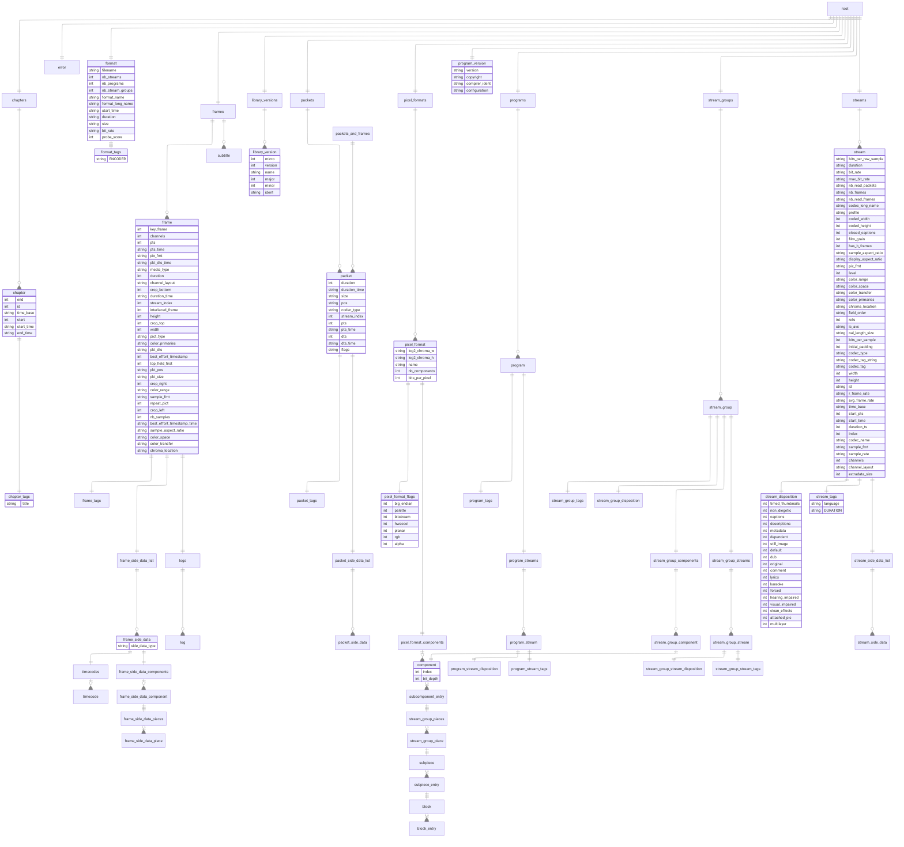

# FFprobe Schema Diagram

## FFprobe Schema Diagram


```mermaid
%%{init: {"theme": "default","layout": "elk","curve": "stepAfter","rankSpacing": 65,"nodeSpacing": 60,"themeCSS": ".root {     --ff-colvideo: #6eaa7b;     --ff-colaudio: #477fb3;     --ff-colsubtitle: #ad76ab;     --ff-coltext: #666; }  .ff-inputfiles rect, .ff-outputfiles rect, .ff-inputstreams rect, .ff-outputstreams rect, .ff-decoders rect, .ff-encoders rect {     stroke-width: 0;     stroke: transparent;     filter: none !important;     fill: transparent !important;     display: none !important; }  .cluster span {     color: var(--ff-coltext); }  .cluster rect {     stroke: #dfdfdf !important;     transform: translateY(-2.3rem);     filter: drop-shadow(1px 2px 2px rgba(185,185,185,0.2)) !important;     rx: 8;     ry: 8; }  .cluster-label {     font-size: 1.1rem; }      .cluster-label .nodeLabel {         display: block;         font-weight: 500;         color: var(--ff-coltext);     }      .cluster-label div {         max-width: unset !important;         padding: 3px;     }      .cluster-label foreignObject {         transform: translateY(-0.7rem);     }  .node.ff-inputfile .label foreignObject, .node.ff-outputfile .label foreignObject {     overflow: visible; }  .cluster.ff-inputfile .cluster-label foreignObject div:not(foreignObject div div), .cluster.ff-outputfile .cluster-label foreignObject div:not(foreignObject div div) {     display: table !important; }  .nodeLabel div.ff-inputfile, .nodeLabel div.ff-outputfile {     font-size: 1.1rem;     font-weight: 500;     min-width: 14rem;     width: 100%;     display: flex;     color: var(--ff-coltext);     margin-top: 0.1rem;     line-height: 1.35;     padding-bottom: 1.9rem; }  .nodeLabel div.ff-outputfile {     flex-direction: row-reverse; }  .ff-inputfile .index, .ff-outputfile .index {     order: 2;     color: var(--ff-coltext);     text-align: center;     border-radius: 0.45rem;     border: 0.18em solid #666666db;     font-weight: 600;     padding: 0 0.3em;     opacity: 0.8; }      .ff-inputfile .index::before {         content: \'In \';     }      .ff-outputfile .index::before {         content: \'Out \';     }  .ff-inputfile .demuxer_name, .ff-outputfile .muxer_name {     flex: 1;     order: 1;     font-size: 0.9rem;     white-space: nowrap;     overflow: hidden;     text-overflow: ellipsis;     text-align: center;     max-width: 8rem;     align-content: center;     margin: 0.2rem 0.4rem 0 0.4rem; }  .ff-inputfile .file_extension, .ff-outputfile .file_extension {     order: 0;     background-color: #888;     color: white;     text-align: center;     border-radius: 0.45rem;     font-weight: 600;     padding: 0 0.4em;     align-content: center;     opacity: 0.8; }  .ff-inputfile .url, .ff-outputfile .url {     order: 4;     text-align: center;     position: absolute;     left: 0;     right: 0;     bottom: 0.75rem;     font-size: 0.7rem;     font-weight: 400;     white-space: nowrap;     overflow: hidden;     text-overflow: ellipsis;     margin: 0 0.3rem;     direction: rtl;     color: #999; }  .cluster.ff-inputfile rect, .cluster.ff-outputfile rect {     transform: translateY(-1.8rem); }  .node.ff-inputstream rect, .node.ff-outputstream rect {     padding: 0 !important;     margin: 0 !important;     border: none !important;     fill: #fcfcfc;     stroke: #e5e5e5 !important;     height: 2.7rem;     transform: translateY(0.2rem);     filter: none;     rx: 3;     ry: 3; }  .node.ff-inputstream .label foreignObject, .node.ff-outputstream .label foreignObject {     transform: translateY(-0.2%);     overflow: visible; }      .node.ff-inputstream .label foreignObject div:not(foreignObject div div), .node.ff-outputstream .label foreignObject div:not(foreignObject div div) {         display: block !important;         line-height: 1.5 !important;     }  .nodeLabel div.ff-inputstream, .nodeLabel div.ff-outputstream {     font-size: 1.0rem;     font-weight: 500;     min-width: 12rem;     width: 100%;     display: flex; }  .nodeLabel div.ff-outputstream {     flex-direction: row-reverse; }  .ff-inputstream .name, .ff-outputstream .name {     flex: 1;     white-space: nowrap;     overflow: hidden;     text-overflow: ellipsis;     text-align: left;     align-content: center;     margin-bottom: -0.15rem; }  .ff-inputstream .index, .ff-outputstream .index {     flex: 0 0 1.4rem;     background-color: #888;     color: white;     text-align: center;     border-radius: 0.3rem;     font-weight: 600;     margin-right: -0.3rem;     margin-left: 0.4rem;     opacity: 0.8; }  .ff-outputstream .index {     margin-right: 0.6rem;     margin-left: -0.4rem; }  .ff-inputstream::before, .ff-outputstream::before {     font-variant-emoji: text;     flex: 0 0 2rem;     margin-left: -0.8rem;     margin-right: 0.2rem; }  .ff-outputstream::before {     margin-left: 0.2rem;     margin-right: -0.6rem; }  .ff-inputstream.video::before, .ff-outputstream.video::before {     content: \'\\239A\';     color: var(--ff-colvideo);     font-size: 2.25rem;     line-height: 0.5;     font-weight: bold; }  .ff-inputstream.audio::before, .ff-outputstream.audio::before {     content: \'\\1F39D\';     color: var(--ff-colaudio);     font-size: 1.75rem;     line-height: 0.9; }  .ff-inputstream.subtitle::before, .ff-outputstream.subtitle::before {     content: \'\\1AC\';     color: var(--ff-colsubtitle);     font-size: 1.2rem;     line-height: 1.1;     transform: scaleX(1.5);     margin-top: 0.050rem; }  .ff-inputstream.attachment::before, .ff-outputstream.attachment::before {     content: \'\\1F4CE\';     font-size: 1.3rem;     line-height: 1.15; }  .ff-inputstream.data::before, .ff-outputstream.data::before {     content: \'\\27E8\\2219\\2219\\2219\\27E9\';     font-size: 1.15rem;     line-height: 1.17;     letter-spacing: -0.3px; }  .cluster.ff-filters rect {     stroke-dasharray: 6 !important;     stroke-width: 1.3px;     stroke: #d1d1d1 !important;     filter: none !important; }  .cluster.ff-filters div.ff-filters .id {     display: none; }  .cluster.ff-filters div.ff-filters .name {     margin-right: 0.5rem;     font-size: 0.9rem; }  .cluster.ff-filters div.ff-filters .description {     font-weight: 400;     font-size: 0.75rem;     vertical-align: middle;     color: #777;     font-family: Cascadia Code, Lucida Console, monospace; }  .node.ff-filter rect {     rx: 10;     ry: 10;     stroke-width: 1px;     stroke: #d3d3d3;     fill: url(#ff-filtergradient);     filter: drop-shadow(1px 1px 2px rgba(0, 0, 0, 0.1)); }  .node.ff-filter .label foreignObject {     transform: translateY(-0.4rem);     overflow: visible; }  .nodeLabel div.ff-filter {     font-size: 1.0rem;     font-weight: 500;     text-transform: uppercase;     min-width: 5.5rem;     margin-bottom: 0.5rem; }      .nodeLabel div.ff-filter span {         color: inherit;     }  .node.ff-decoder rect, .node.ff-encoder rect {     stroke-width: 1px;     stroke: #d3d3d3;     fill: url(#ff-filtergradient);     filter: drop-shadow(1px 1px 2px rgba(0, 0, 0, 0.1)); }  .nodeLabel div.ff-decoder, .nodeLabel div.ff-encoder {     font-size: 0.85rem;     font-weight: 500;     min-width: 3.5rem; }  path.flowchart-link[id|=\'video\'] {     stroke: var(--ff-colvideo); }  path.flowchart-link[id|=\'audio\'] {     stroke: var(--ff-colaudio); }  path.flowchart-link[id|=\'subtitle\'] {     stroke: var(--ff-colsubtitle); }  marker.marker path {     fill: context-stroke; }  .edgeLabel foreignObject {     transform: translateY(-1rem); }  .edgeLabel p {     background: transparent;     white-space: nowrap;     margin: 1rem 0.5rem !important;     font-weight: 500;     color: var(--ff-coltext); }  .edgeLabel, .labelBkg {     background: transparent; }  .edgeLabels .edgeLabel * {     font-size: 0.8rem; } ","fontFamily": "Roboto,Segoe UI,sans-serif","themeVariables": { "clusterBkg": "white", "primaryBorderColor": "gray", "lineColor": "gray", "secondaryTextColor": "gray", "tertiaryBorderColor": "gray", "primaryTextColor": "#666", "secondaryTextColor": "red" },"er": { "diagramPadding": 12, "entityPadding": 4, "minEntityWidth": 150, "minEntityHeight": 20, "curve": "stepAfter" } }}%%

erDiagram

  chapter {
      int end 
      int id 
      string time_base 
      int start 
      string start_time 
      string end_time 
  }


  chapter ||--|| chapter_tags : ""

  chapter_tags {
      string title 
  }


  chapters {
  }


  chapters ||--o{ chapter : ""

  error {
  }


  format {
      string filename 
      int nb_streams 
      int nb_programs 
      int nb_stream_groups 
      string format_name 
      string format_long_name 
      string start_time 
      string duration 
      string size 
      string bit_rate 
      int probe_score 
  }


  format ||--|| format_tags : ""

  format_tags {
      string ENCODER 
  }


  frame {
      int key_frame 
      int channels 
      int pts 
      string pts_time 
      string pix_fmt 
      string pkt_dts_time 
      string media_type 
      int duration 
      string channel_layout 
      int crop_bottom 
      string duration_time 
      int stream_index 
      int interlaced_frame 
      int height 
      int crop_top 
      int width 
      string pict_type 
      string color_primaries 
      string pkt_dts 
      int best_effort_timestamp 
      int top_field_first 
      string pkt_pos 
      string pkt_size 
      int crop_right 
      string color_range 
      string sample_fmt 
      int repeat_pict 
      int crop_left 
      int nb_samples 
      string best_effort_timestamp_time 
      string sample_aspect_ratio 
      string color_space 
      string color_transfer 
      string chroma_location 
  }


  frame ||--|| frame_tags : ""
  frame ||--|| frame_side_data_list : ""
  frame ||--|| logs : ""

  frames {
  }


  frames ||--o{ frame : ""
  frames ||--o{ subtitle : ""

  frame_tags {
  }


  frame_side_data_list {
  }


  frame_side_data_list ||--o{ frame_side_data : ""

  frame_side_data {
      string side_data_type 
  }


  frame_side_data ||--|| timecodes : ""
  frame_side_data ||--|| frame_side_data_components : ""

  timecodes {
  }


  timecodes ||--o{ timecode : ""

  timecode {
  }


  frame_side_data_components {
  }


  frame_side_data_components ||--o{ frame_side_data_component : ""

  frame_side_data_component {
  }


  frame_side_data_component ||--|| frame_side_data_pieces : ""

  frame_side_data_pieces {
  }


  frame_side_data_pieces ||--o{ frame_side_data_piece : ""

  frame_side_data_piece {
  }


  log {
  }


  logs {
  }


  logs ||--o{ log : ""

  library_version {
      int micro 
      int version 
      string name 
      int major 
      int minor 
      string ident 
  }


  library_versions {
  }


  library_versions ||--o{ library_version : ""

  packet {
      int duration 
      string duration_time 
      string size 
      string pos 
      string codec_type 
      int stream_index 
      int pts 
      string pts_time 
      int dts 
      string dts_time 
      string flags 
  }


  packet ||--|| packet_tags : ""
  packet ||--|| packet_side_data_list : ""

  packet_tags {
  }


  packets {
  }


  packets ||--o{ packet : ""

  packets_and_frames {
  }


  packets_and_frames ||--o{ packet : ""

  packet_side_data_list {
  }


  packet_side_data_list ||--o{ packet_side_data : ""

  packet_side_data {
  }


  pixel_format {
      string log2_chroma_w 
      string log2_chroma_h 
      string name 
      int nb_components 
      int bits_per_pixel 
  }


  pixel_format ||--|| pixel_format_flags : ""
  pixel_format ||--|| pixel_format_components : ""

  pixel_format_flags {
      int big_endian 
      int palette 
      int bitstream 
      int hwaccel 
      int planar 
      int rgb 
      int alpha 
  }


  component {
      int index 
      int bit_depth 
  }


  pixel_format_components {
  }


  pixel_format_components ||--o{ component : ""

  pixel_formats {
  }


  pixel_formats ||--o{ pixel_format : ""

  program_stream_disposition {
  }


  program_stream_tags {
  }


  program {
  }


  program ||--|| program_tags : ""
  program ||--|| program_streams : ""

  program_streams {
  }


  program_streams ||--o{ program_stream : ""

  program_stream {
  }


  program_stream ||--|| program_stream_disposition : ""
  program_stream ||--|| program_stream_tags : ""

  program_tags {
  }


  program_version {
      string version 
      string copyright 
      string compiler_ident 
      string configuration 
  }


  programs {
  }


  programs ||--o{ program : ""

  stream_group_stream_disposition {
  }


  stream_group_stream_tags {
  }


  stream_group {
  }


  stream_group ||--|| stream_group_tags : ""
  stream_group ||--|| stream_group_disposition : ""
  stream_group ||--|| stream_group_components : ""
  stream_group ||--|| stream_group_streams : ""

  stream_group_components {
  }


  stream_group_components ||--o{ stream_group_component : ""

  stream_group_component {
  }


  stream_group_component ||--|| component : ""

  component {
  }


  component ||--o{ subcomponent_entry : ""

  subcomponent_entry {
  }


  subcomponent_entry ||--|| stream_group_pieces : ""

  stream_group_pieces {
  }


  stream_group_pieces ||--o{ stream_group_piece : ""

  stream_group_piece {
  }


  stream_group_piece ||--|| subpiece : ""

  subpiece {
  }


  subpiece ||--o{ subpiece_entry : ""

  subpiece_entry {
  }


  subpiece_entry ||--|| block : ""

  block {
  }


  block ||--o{ block_entry : ""

  block_entry {
  }


  stream_group_streams {
  }


  stream_group_streams ||--o{ stream_group_stream : ""

  stream_group_stream {
  }


  stream_group_stream ||--|| stream_group_stream_disposition : ""
  stream_group_stream ||--|| stream_group_stream_tags : ""

  stream_group_disposition {
  }


  stream_group_tags {
  }


  stream_groups {
  }


  stream_groups ||--o{ stream_group : ""

  root {
  }


  root ||--|| chapters : ""
  root ||--|| format : ""
  root ||--|| frames : ""
  root ||--|| programs : ""
  root ||--|| stream_groups : ""
  root ||--|| streams : ""
  root ||--|| packets : ""
  root ||--|| error : ""
  root ||--|| program_version : ""
  root ||--|| library_versions : ""
  root ||--|| pixel_formats : ""

  stream {
      string bits_per_raw_sample 
      string duration 
      string bit_rate 
      string max_bit_rate 
      string nb_read_packets 
      string nb_frames 
      string nb_read_frames 
      string codec_long_name 
      string profile 
      int coded_width 
      int coded_height 
      int closed_captions 
      int film_grain 
      int has_b_frames 
      string sample_aspect_ratio 
      string display_aspect_ratio 
      string pix_fmt 
      int level 
      string color_range 
      string color_space 
      string color_transfer 
      string color_primaries 
      string chroma_location 
      string field_order 
      int refs 
      string is_avc 
      string nal_length_size 
      int bits_per_sample 
      int initial_padding 
      string codec_type 
      string codec_tag_string 
      string codec_tag 
      int width 
      int height 
      string id 
      string r_frame_rate 
      string avg_frame_rate 
      string time_base 
      int start_pts 
      string start_time 
      int duration_ts 
      int index 
      string codec_name 
      string sample_fmt 
      string sample_rate 
      int channels 
      string channel_layout 
      int extradata_size 
  }


  stream ||--|| stream_disposition : ""
  stream ||--|| stream_tags : ""
  stream ||--|| stream_side_data_list : ""

  stream_disposition {
      int timed_thumbnails 
      int non_diegetic 
      int captions 
      int descriptions 
      int metadata 
      int dependent 
      int still_image 
      int default 
      int dub 
      int original 
      int comment 
      int lyrics 
      int karaoke 
      int forced 
      int hearing_impaired 
      int visual_impaired 
      int clean_effects 
      int attached_pic 
      int multilayer 
  }


  streams {
  }


  streams ||--o{ stream : ""

  stream_tags {
      string language 
      string DURATION 
  }


  stream_side_data_list {
  }


  stream_side_data_list ||--o{ stream_side_data : ""

  stream_side_data {
  }


  subtitle {
  }


```

### Command Line

```
ffmpeg ...something with print_schema or similar-..
```
