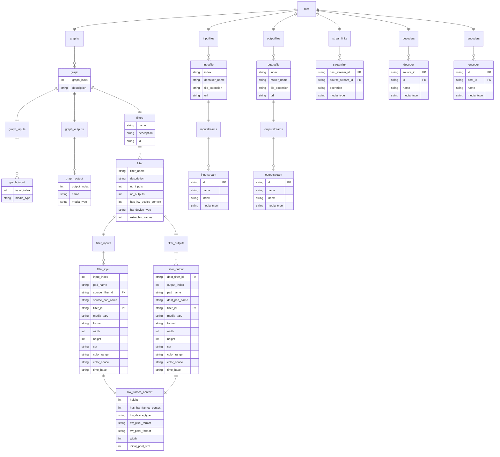

# Execution Graph Schema Diagram

## Execution Graph Schema Diagram


```mermaid
erDiagram

  root {
  }

  root ||--|| graphs : ""
  root ||--|| inputfiles : ""
  root ||--|| outputfiles : ""
  root ||--|| decoders : ""
  root ||--|| encoders : ""
  root ||--|| streamlinks : ""

  graphs {
  }


  graphs ||--o{ graph : ""

  graph {
      int graph_index 
      string description 
  }


  graph ||--|| graph_inputs : ""
  graph ||--|| graph_outputs : ""
  graph ||--|| filters : ""

  graph_inputs {
  }


  graph_inputs ||--o{ graph_input : ""

  graph_input {
      int input_index 
      string media_type 
  }


  graph_outputs {
  }


  graph_outputs ||--o{ graph_output : ""

  graph_output {
      int output_index 
      string name 
      string media_type 
  }


  filters {
      string name 
      string description 
      string id 
  }


  filters ||--o{ filter : ""

  filter {
      string filter_name 
      string description 
      int nb_inputs 
      int nb_outputs 
      int has_hw_device_context 
      string hw_device_type 
      int extra_hw_frames 
  }


  filter ||--|| filter_inputs : ""
  filter ||--|| filter_outputs : ""

  filter_inputs {
  }


  filter_inputs ||--o{ filter_input : ""

  filter_input {
      int input_index 
      string pad_name 
      string source_filter_id FK
      string source_pad_name 
      string filter_id PK
      string media_type 
      string format 
      int width 
      int height 
      string sar 
      string color_range 
      string color_space 
      string time_base 
  }


  filter_input ||--|| hw_frames_context : ""

  filter_outputs {
  }


  filter_outputs ||--o{ filter_output : ""

  filter_output {
      string dest_filter_id FK
      int output_index 
      string pad_name 
      string dest_pad_name 
      string filter_id PK
      string media_type 
      string format 
      int width 
      int height 
      string sar 
      string color_range 
      string color_space 
      string time_base 
  }


  filter_output ||--|| hw_frames_context : ""

  hw_frames_context {
      int height 
      int has_hw_frames_context 
      string hw_device_type 
      string hw_pixel_format 
      string sw_pixel_format 
      int width 
      int initial_pool_size 
  }


  inputfiles {
  }


  inputfiles ||--o{ inputfile : ""

  inputfile {
      string index 
      string demuxer_name 
      string file_extension 
      string url 
  }


  inputfile ||--|| inputstreams : ""

  inputstreams {
  }


  inputstreams ||--o{ inputstream : ""

  inputstream {
      string id PK
      string name 
      string index 
      string media_type 
  }


  outputfiles {
  }


  outputfiles ||--o{ outputfile : ""

  outputfile {
      string index 
      string muxer_name 
      string file_extension 
      string url 
  }


  outputfile ||--|| outputstreams : ""

  outputstreams {
  }


  outputstreams ||--o{ outputstream : ""

  outputstream {
      string id PK
      string name 
      string index 
      string media_type 
  }


  streamlinks {
  }


  streamlinks ||--o{ streamlink : ""

  streamlink {
      string dest_stream_id FK
      string source_stream_id FK
      string operation 
      string media_type 
  }


  decoders {
  }


  decoders ||--o{ decoder : ""

  decoder {
      string source_id FK
      string id PK
      string name 
      string media_type 
  }


  encoders {
  }


  encoders ||--o{ encoder : ""

  encoder {
      string id PK
      string dest_id FK
      string name 
      string media_type 
  }


```

### Command Line

```
ffmpeg ...something with print_schema or similar-..
```
